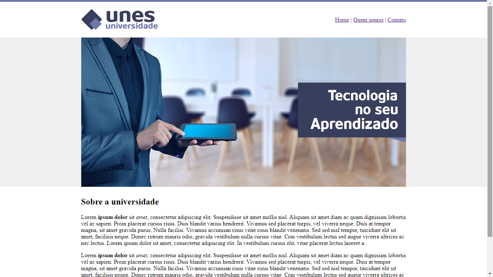

# Unes-Universidade

Este projeto é pessoal para estudo e aprofundamento em tecnologias Web

# Recursos

* O site é uma página estática para praticar html, css, e outras tecnologias mais básicas para solidificar conhecimento estruturais da web.
* O site foi desenvolvido com JavaScript, CSS e HTML.

# Uso

1. Clone o repositório do GitHub.
2. Abra o projeto no seu editor de código.
3. Abra o arquivo index.html (Página estática).

# Créditos

Este projeto foi criado por Alaska Websites.
